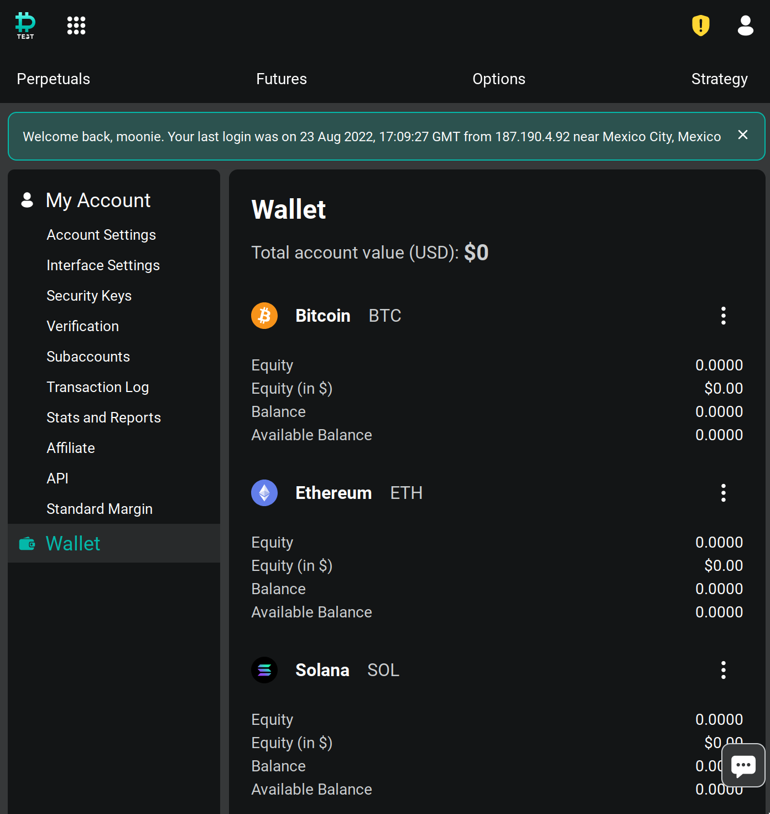
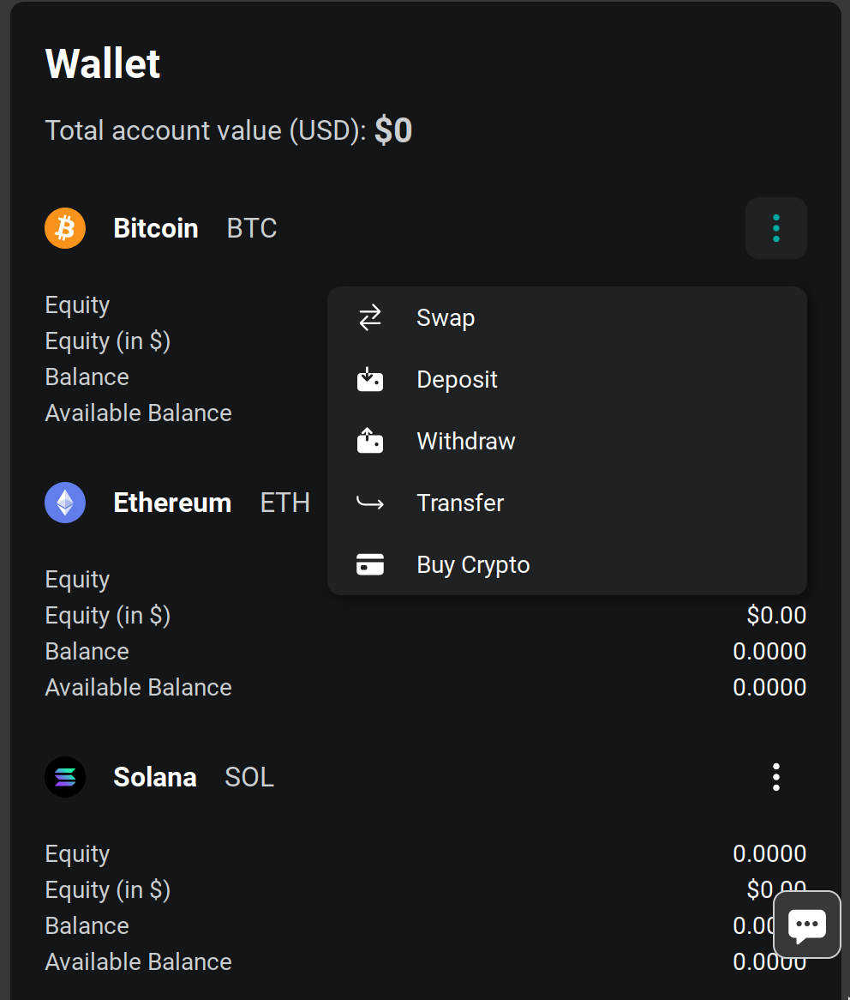
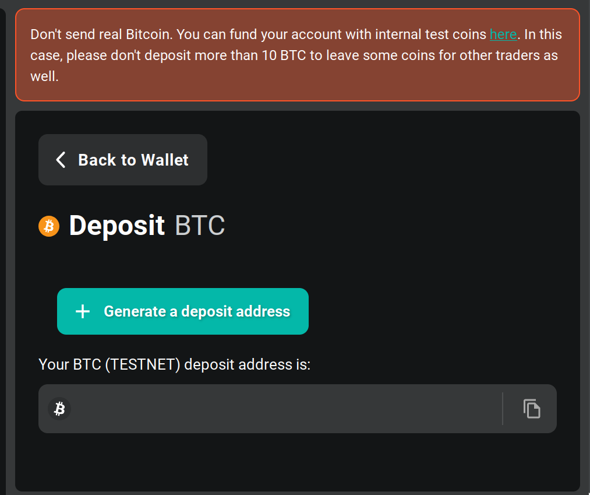
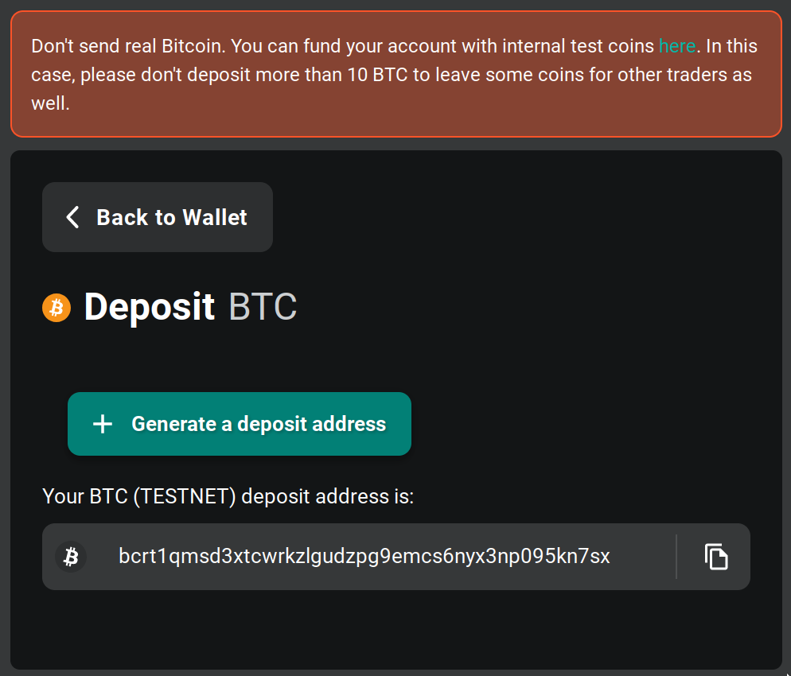

``deribit`` backend
------------------
pretty good liquidity crypto derivatives, uses custom json rpc over ws for
client methods, then `cryptofeed` for data streams.

status
******
- supports option charts
- no order support yet 

config
******
In order to get order mode support your ``brokers.toml``
needs to have something like the following:

.. code:: toml

    [deribit]
    key_id = 'XXXXXXXX'
    key_secret = 'Xx_XxXxXxXxXxXxXxXxXxXxXxXxXxXxXxXxXxXxXxXx'

To obtain an api id and secret you need to create an account, which can be a
real market account over at:

    - deribit.com  (requires KYC for deposit address)

Or a testnet account over at:

    - test.deribit.com

For testnet once the account is created here is how you deposit fake crypto to
try it out:

1) Go to Wallet:

2) Then click on the elipsis menu and select deposit

3) This will take you to the deposit address page

4) After clicking generate you should see the address, copy it and go to the 
`coin faucet <https://test.deribit.com/dericoin/BTC/deposit>`_ and send fake
coins to that address.

5) Back in the deposit address page you should see the deposit in your history

.. figure:: assets/4_wallet_deposit_history.png
    :align: center
    :target: assets/4_wallet_deposit_history.png
    :alt: wallet deposit history
